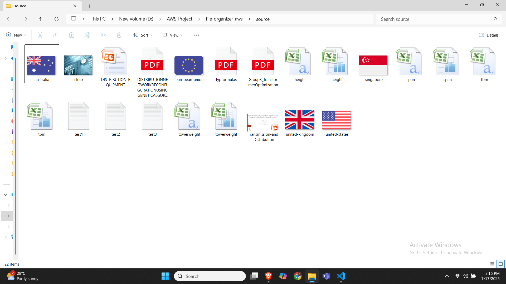
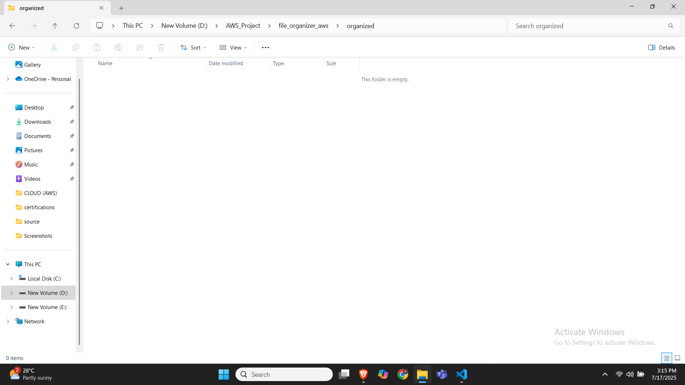
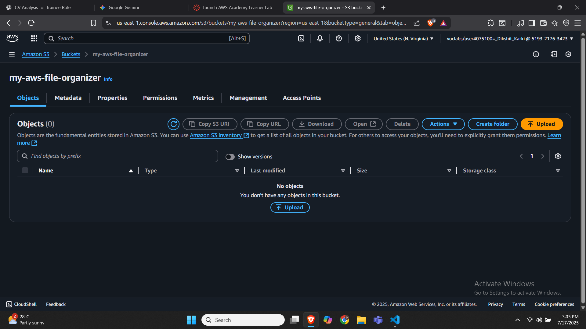
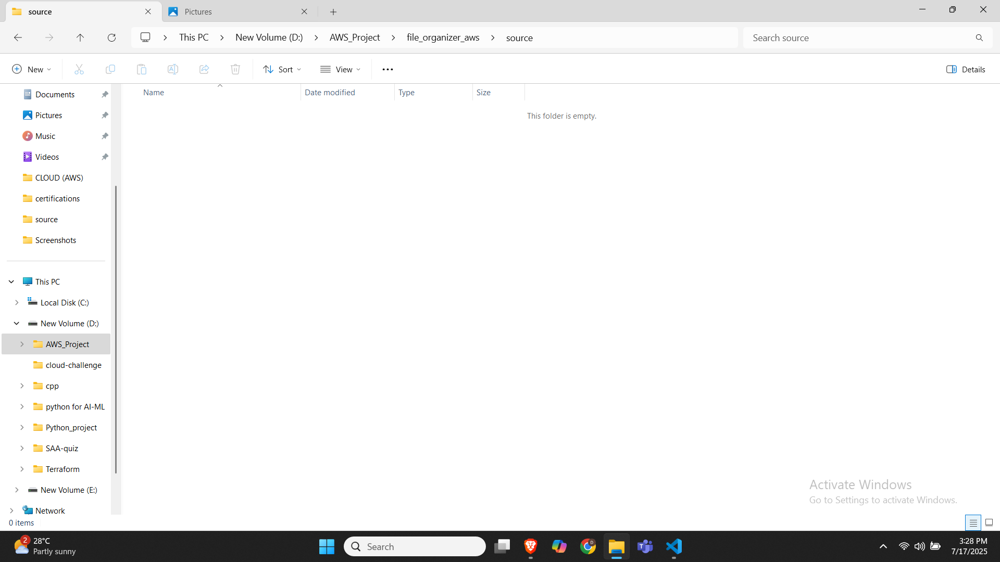
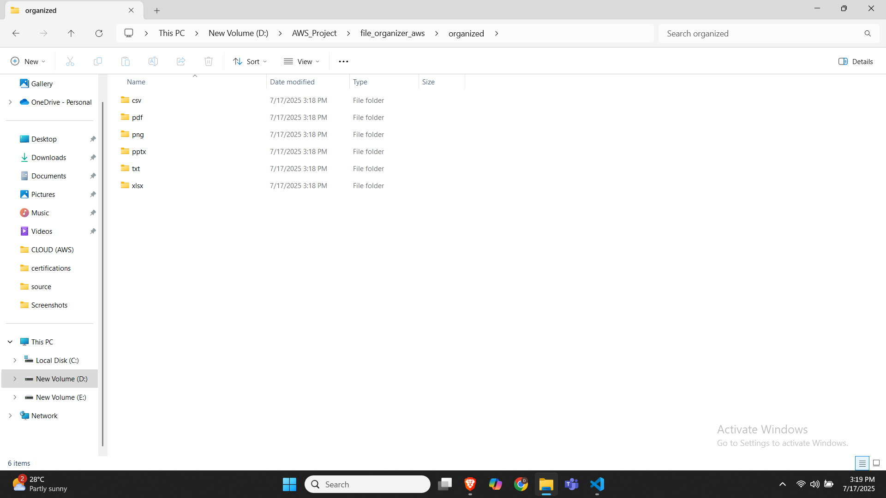
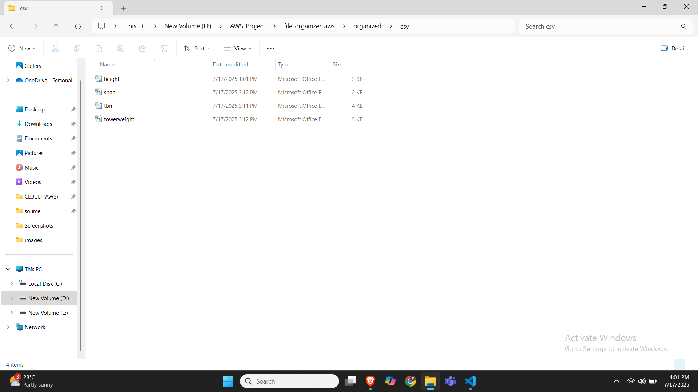
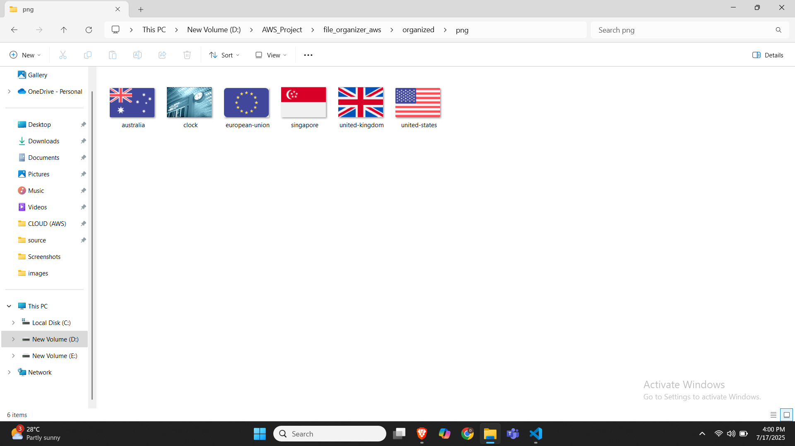
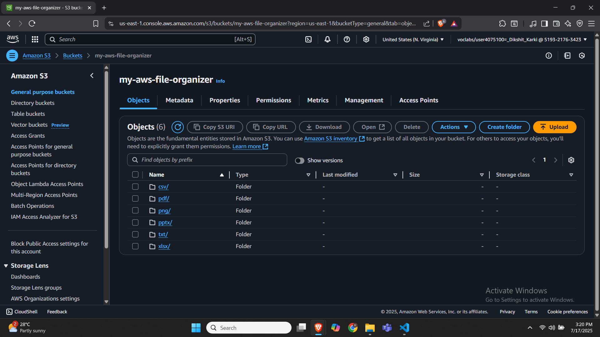
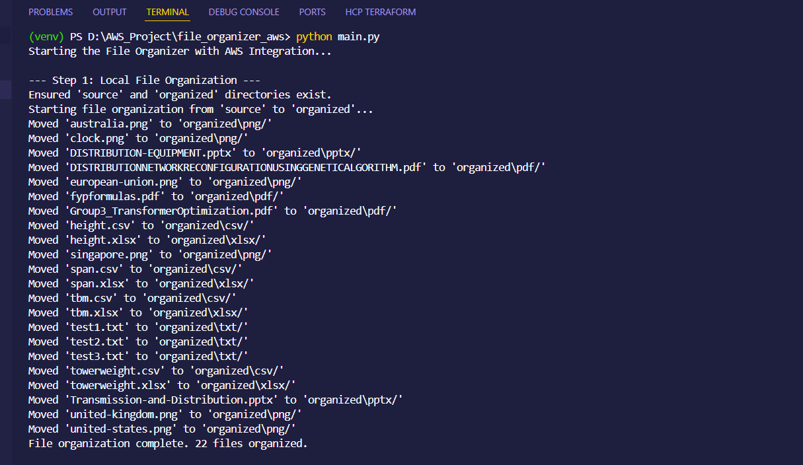
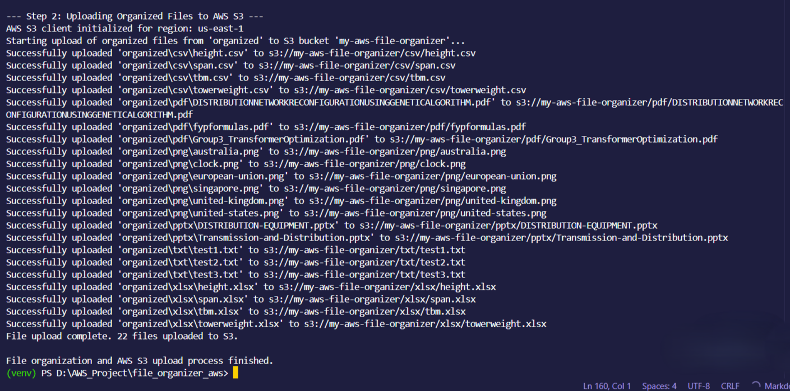

# File Organizer with AWS S3 Integration

## Project Overview

This Python-based project automates the organization of local files by their extensions and then securely uploads these organized files to an AWS S3 bucket. It demonstrates practical skills in file system manipulation, modular Python programming, and integration with cloud services (AWS S3). The project also highlights the use of Bash scripting for workflow automation.

## Features

* **Local File Organization:** Automatically categorizes files from a specified source directory into extension-based subdirectories (e.g., `txt/`, `png/`, `csv/`) within an `organized/` folder. Files without extensions are moved to a `no_extension/` directory.
* **AWS S3 Upload:** Securely uploads the locally organized files to a designated AWS S3 bucket, preserving the directory structure (e.g., `s3://your-bucket/txt/document.txt`).
* **Modular Design:** Separates concerns into distinct Python modules (`file_organizer.py`, `aws_uploader.py`, `main.py`) for better maintainability and readability.
* **Bash Automation:** Includes an optional Bash script (`organize_and_upload.sh`) to streamline the entire process, including virtual environment activation and environment variable management.
* **Cloud Integration Practice:** Strengthens skills in working with `boto3`, the AWS SDK for Python, and managing AWS credentials.

## Project Structure


file-organizer-aws/
├── source/                         # Unorganized files (input)
│   ├── test1.txt
│   ├── pic1.png
│   └── info.csv
│
├── organized/                      # Auto-created by script: sorted by extension
│   ├── txt/
│   ├── png/
│   ├── csv/
│   ├── xlsx/
|   ├── pdf/
│   └── pptx/
│
├── file_organizer.py               # Python class to organize files locally
├── aws_uploader.py                 # Python class for uploading to AWS S3
├── main.py                         # The entry point script to orchestrate the process
│
├── organize_and_upload.sh          # Bash script to automate running everything
│
├── requirements.txt                # Python dependencies (contains boto3)
├── README.md                       # Project overview, usage instructions (this file)
└── venv/                           # Python Virtual Environment (created during setup)


## Prerequisites

Before running this project, ensure you have the following installed:

* **Python 3.x**
* **pip** (Python package installer, usually comes with Python)
* **AWS Account:** With permissions to create and manage S3 buckets.
* **AWS CLI:** (Optional, but highly recommended for managing credentials locally).

## Setup

1.  **Clone the Repository:**
    ```bash
    git clone [https://github.com/your-username/file-organizer-aws.git](https://github.com/your-username/file-organizer-aws.git)
    cd file-organizer-aws
    ```

2.  **Create a Python Virtual Environment:**
    It's good practice to isolate your project dependencies.
    ```bash
    python3 -m venv venv
    ```

3.  **Activate the Virtual Environment:**
    * **macOS/Linux:**
        ```bash
        source venv/bin/activate
        ```        ```
    * **Windows (PowerShell):**
        ```powershell
        .\venv\Scripts\Activate.ps1
        ```

4.  **Install Python Dependencies:**
    ```bash
    pip install -r requirements.txt
    ```

5.  **Configure AWS Credentials:**
    This project uses `boto3` to interact with AWS S3. You need to provide your AWS credentials.

    * **For AWS Learners Lab / Temporary Credentials:**
        If you are using temporary credentials likr me (e.g., from an AWS Learners Lab), you **must** set them as environment variables in your terminal session *before* running the script.
        ```bash
        # Replace with your actual Learners Lab credentials and bucket details
        export AWS_ACCESS_KEY_ID="YOUR_LEARNERS_LAB_ACCESS_KEY_ID"
        export AWS_SECRET_ACCESS_KEY="YOUR_LEARNERS_LAB_SECRET_ACCESS_KEY"
        export AWS_SESSION_TOKEN="YOUR_LEARNERS_LAB_SESSION_TOKEN"
        export S3_BUCKET_NAME="your-unique-s3-bucket-name-here" # e.g., my-learners-lab-bucket
        export AWS_REGION="us-east-1" # e.g., us-east-1 (match your S3 bucket's region)
        ```

    * **For Permanent IAM User Credentials (if not using Learners Lab):**
        The easiest way is to use the AWS CLI:
        ```bash
        aws configure
        # Follow prompts for AWS Access Key ID, Secret Access Key, Default region name (e.g., us-east-1), and Default output format (e.g., json).
        ```
        Ensure the IAM user has permissions to put objects into the specified S3 bucket.

6.  **Create an S3 Bucket:**
    If you haven't already, create an S3 bucket in your AWS account via the AWS Management Console. Note its exact name and region. Update the `S3_BUCKET_NAME` and `AWS_REGION` variables in `organize_and_upload.sh` (and `main.py` if not using environment variables) to match your bucket.

## Usage

1.  **Place Unorganized Files:**
    Put all the files you want to organize and upload into the `source/` directory.

2.  **Run the Automation Script:**
    Make the bash script executable:
    ```bash
    chmod +x organize_and_upload.sh
    ```
    Then, execute the script:
    ```bash
    ./organize_and_upload.sh
    ```

    The script will:
    * Activate the virtual environment.
    * Install Python dependencies (if needed).
    * Run `main.py`, which in turn will:
        * Organize files from `source/` into extension-based subdirectories in `organized/`.
        * Upload the organized files from `organized/` to your specified AWS S3 bucket.

## Demonstration / Proof of Concept

Since the project doesn't run continuously, here are some screenshots to demonstrate the visual evidence.

1.  **Before Execution:**
    * Screenshot of the`source/`directory with unorganized files.
    

    * Screenshot of`organized/`directory.
    

    * Screenshot of my-aws-file-organizer S3 Bucket.
    

    
2.  **After Local Organization:**

    * Screenshot of the`source/`directory.
    

    * Screenshot of`organized/`directory with unorganized files.
    

    * Screenshot of`csv/`directory with organized csv files.
    

    * Screenshot of`png/`directory with organized png files.
    


3.  **AWS S3 Upload Confirmation:**
    * Screenshot of my-aws-file-organizer S3 Bucket.
    

4.  **Terminal Output:**
    * Screenshot of Terminal Output.
    
    


